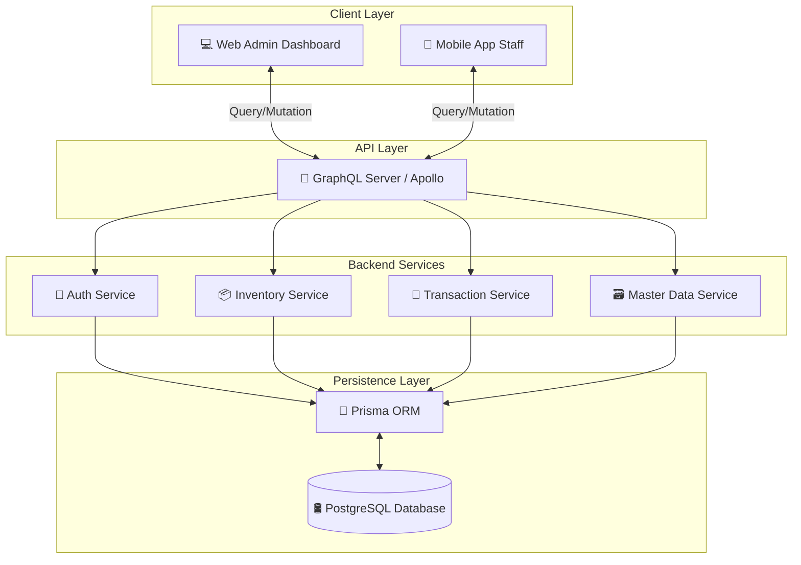
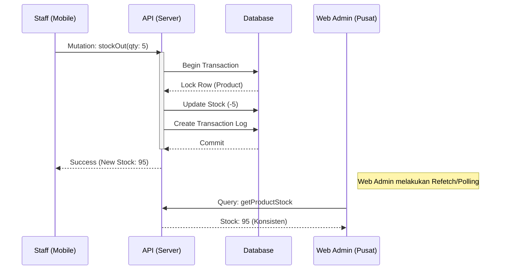

# Nexus Inventory System

Sistem manajemen inventaris *hybrid* Enterprise-grade yang dirancang dengan pendekatan **Modular Monolith** untuk fleksibilitas, skalabilitas, dan konsistensi data tinggi. Solusi ini menghubungkan Web Admin Pusat dengan Aplikasi Mobile Operasional Gudang secara seamless.

---

## 🏛️ Arsitektur & Desain Sistem

Sistem ini dibangun di atas arsitektur **Client-Server** modern yang memanfaatkan **GraphQL** sebagai layer komunikasi data yang efisien dan *type-safe*.

### 📊 Diagram Arsitektur (High-Level)



### 🧩 Prinsip Desain Modular

Sistem dirancang agar setiap komponen memiliki tanggung jawab tunggal (*Single Responsibility*) namun tetap terintegrasi dalam satu ekosistem:

1.  **Backend (The Core)**:
    -   **Modular Resolvers**: Resolver GraphQL dipisah berdasarkan domain (Product, Warehouse, Transaction).
    -   **Prisma ORM**: Abstraksi database yang kuat untuk menjamin integritas relasi data.
    -   **Service Layer**: Logika bisnis dipisahkan dari resolver untuk kemudahan testing dan maintenance.

2.  **Web Admin (The Command Center)**:
    -   **Component-Based**: Menggunakan React Components yang reusable (Button, Card, Chart).
    -   **Hooks Pattern**: Logika state management (data fetching, caching) dibungkus dalam Custom Hooks.
    -   **Atomic Design**: Struktur UI dari atom (icon) hingga pages (Dashboard).

3.  **Mobile App (The Operational Arm)**:
    -   **Provider Pattern**: Manajemen state global untuk autentikasi dan data sesi.
    -   **Widget Composition**: UI Flutter yang disusun dari widget-widget kecil yang modular.

---

## 🔄 Alur Data Konsisten (Data Flow)

Sistem menggunakan **GraphQL** untuk menjamin konsistensi data antara Server, Web, dan Mobile.

### 1. Pola Komunikasi (Request-Response Cycle)
Semua komunikasi data mengikuti pola standar yang ketat untuk mencegah *race condition* dan inkonsistensi data:

1.  **Client Request**:
    -   Web/Mobile mengirim operasi `Query` (baca) atau `Mutation` (tulis).
    -   Payload divalidasi tipe datanya secara otomatis oleh Schema GraphQL.

2.  **Server Processing**:
    -   **Authentication Middleware**: Memverifikasi token JWT user.
    -   **Resolver Execution**: Menjalankan logika bisnis spesifik.
    -   **Database Transaction**: Menggunakan Prisma `$transaction` untuk operasi multi-tabel (misal: Barang Keluar -> Kurangi Stok -> Catat Log). Jika satu gagal, semua dibatalkan (*Atomicity*).

3.  **Response & Update**:
    -   Server mengembalikan data JSON terstruktur sesuai request client.
    -   **Apollo Client Cache** (di Web) otomatis memperbarui UI tanpa perlu reload halaman manual.

### 2. Skenario Kritis: Sinkronisasi Stok


---

## 🕸️ Implementasi GraphQL

Implementasi GraphQL pada sistem ini dirancang untuk **performa tinggi** dan **kemudahan pemeliharaan**.

### 1. Skema Lengkap (Schema Definition)
Kami menggunakan pendekatan **Schema-First** dengan definisi tipe yang terpusat namun terbagi secara modular.

**Struktur `rootTypeDefs`:**
```graphql
type Query {
  # Master Data Access
  warehouses: [Warehouse]
  products: [Product]
  product(id: ID!): Product
  productBySku(sku: String!): Product
  
  # Transactional Data
  transactions(limit: Int): [StockTransaction]
  
  # Identity
  me: User
  users: [User]
}

type Mutation {
  # Inventory Operations (Atomic)
  inboundStock(warehouseId: ID!, productId: ID!, quantity: Int!, note: String): StockTransaction
  outboundStock(warehouseId: ID!, productId: ID!, quantity: Int!, note: String): StockTransaction
  transferStock(fromWarehouseId: ID!, toWarehouseId: ID!, productId: ID!, quantity: Int!, note: String): StockTransaction

  # CRUD Operations
  createProduct(sku: String!, name: String!, ...): Product
  createWarehouse(name: String!, ...): Warehouse
}
```

### 2. Struktur Modular
Kode backend dipecah menjadi modul-modul kecil agar mudah dikelola:

-   **`typeDefs/*.graphql`**: Definisi tipe data (Product, User, Warehouse) dipisah ke file masing-masing.
-   **`resolvers/*.ts`**: Logika penyelesaian data dipisah per domain.
    -   `product.ts`: Menangani logika stok dan produk.
    -   `transaction.ts`: Menangani mutasi stok masuk/keluar.
    -   `user.ts`: Menangani autentikasi dan manajemen user.
-   **`index.ts` (Aggregator)**: Menggabungkan semua TypeDefs dan Resolvers sebelum diserahkan ke Apollo Server.

### 3. Query & Mutation Optimal
Kami menerapkan teknik optimasi di level Resolver:

-   **Prisma Aggregations**: Field seperti `totalStock` dan `isLowStock` dihitung menggunakan `prisma.aggregate` secara efisien di database, bukan meloop array di memori aplikasi.
    ```typescript
    // Contoh Optimasi Resolver
    totalStock: async (parent, _, { prisma }) => {
      const aggregate = await prisma.stockItem.aggregate({
        _sum: { quantity: true },
        where: { productId: parent.id },
      })
      return aggregate._sum.quantity || 0
    }
    ```
-   **Atomic Transactions**: Mutasi stok dibungkus dalam `prisma.$transaction`. Ini menjamin bahwa update stok dan pencatatan riwayat transaksi terjadi bersamaan atau tidak sama sekali.

### 4. Error Handling
Sistem menangani error secara terstruktur:
-   **Validation**: Input divalidasi di level schema (e.g., `ID!`, `Int!`) dan di resolver (e.g., cek stok negatif).
-   **Transactional Integrity**: Jika terjadi error di tengah proses mutasi (misal: stok tidak cukup), seluruh perubahan dibatalkan (Rollback) dan pesan error yang deskriptif dikembalikan ke client.
-   **Typed Errors**: Menggunakan standar error GraphQL untuk memudahkan debugging di sisi client.

---

## 🐳 Implementasi Docker & Deployment

Infrastruktur sistem menggunakan Docker untuk menjamin konsistensi lingkungan dari development hingga production.

### 1. Dockerfile Optimal
Backend menggunakan strategi containerization yang efisien:

-   **Base Image**: `node:22-bookworm-slim`. Menggunakan varian `slim` berbasis Debian Bookworm untuk ukuran image yang lebih kecil namun tetap kompatibel dengan library native yang dibutuhkan Prisma (OpenSSL).
-   **Layer Caching**: `COPY package*.json` dilakukan sebelum `COPY .` agar Docker dapat menggunakan cache layer saat menginstall dependencies, mempercepat proses build ulang.
-   **Compatibility**: Disetup khusus untuk mendukung Prisma Node-API Engine (`libquery_engine`) di lingkungan Linux.

```dockerfile
# Contoh Optimasi Layering
FROM node:22-bookworm-slim
WORKDIR /app
# 1. Install dependencies (Cached)
COPY package*.json ./
RUN npm ci || npm install
# 2. Copy source code (Changed frequently)
COPY . .
# 3. Runtime
CMD ["npm", "start"]
```

### 2. Orchestration (Docker Compose)
Layanan diorkestrasi menggunakan `docker-compose.yml` yang menghubungkan tiga komponen utama:

1.  **`nexus-api` (Backend)**:
    -   Menjalankan server GraphQL.
    -   Otomatis menjalankan `prisma generate` dan `db push` saat startup untuk memastikan skema database sinkron.
    -   Terhubung ke database via internal network docker.
2.  **`nexus-db` (Database)**:
    -   PostgreSQL 15 dengan persistensi data menggunakan **Docker Volumes** (`pg_data`).
    -   Terisolasi dalam jaringan internal, hanya port 5432 yang diekspos jika diperlukan debugging.
3.  **`ngrok` (Public Tunnel)**:
    -   Membuka tunnel aman ke `nexus-api` agar aplikasi mobile bisa mengakses backend localhost dari jaringan publik/internet.

### 3. Stabilitas & Reliability
Sistem dirancang untuk "Self-Healing" dan stabil:

-   **Healthchecks**: Service Database memiliki `healthcheck` native (`pg_isready`).
    ```yaml
    healthcheck:
      test: ["CMD-SHELL", "pg_isready -U postgres -d inventory"]
      interval: 5s
      retries: 20
    ```
-   **Dependency Management**: Service API dikonfigurasi dengan `depends_on: condition: service_healthy`. Ini mencegah API crash karena mencoba konek ke database yang belum siap (Race Condition saat startup).
-   **Restart Policies**: Semua container menggunakan `restart: unless-stopped` untuk memastikan layanan otomatis hidup kembali jika terjadi crash atau server reboot.

---

## 📚 API Documentation

Dokumentasi lengkap untuk endpoint GraphQL utama. Gunakan Apollo Sandbox (`http://localhost:4000`) untuk testing.

### 🔐 1. Authentication

**Login & Get Token**
Mengembalikan token JWT untuk autentikasi request selanjutnya.

**Request:**
```graphql
mutation LoginUser {
  login(email: "admin@nexus.com", password: "password123")
}
```

**Response:**
```json
{
  "data": {
    "login": "eyJhbGciOiJIUzI1NiIsInR5cCI6IkpXVCJ9..."
  }
}
```

### 📦 2. Product Management

**Get All Products (With Stock)**
Mengambil daftar produk beserta total stok global dan status *Low Stock*.

**Request:**
```graphql
query GetProducts {
  products {
    id
    sku
    name
    category
    price
    totalStock
    isLowStock
  }
}
```

**Response:**
```json
{
  "data": {
    "products": [
      {
        "id": "prod_123",
        "sku": "SKU-MILK-001",
        "name": "Susu UHT Full Cream",
        "category": "minuman",
        "price": 18000,
        "totalStock": 150,
        "isLowStock": false
      }
    ]
  }
}
```

### 🏭 3. Warehouse Operations (Mobile)

**Inbound Stock (Barang Masuk)**
Menambah stok di gudang tertentu. Operasi ini bersifat *Atomic*.

**Request:**
```graphql
mutation InboundItem {
  inboundStock(
    warehouseId: "wh_abc", 
    productId: "prod_123", 
    quantity: 50, 
    note: "Restock dari Supplier"
  ) {
    id
    type
    quantity
    product {
      name
      totalStock
    }
    timestamp
  }
}
```

**Response:**
```json
{
  "data": {
    "inboundStock": {
      "id": "tx_999",
      "type": "INBOUND",
      "quantity": 50,
      "product": {
        "name": "Susu UHT Full Cream",
        "totalStock": 200
      },
      "timestamp": "2024-01-08T10:00:00.000Z"
    }
  }
}
```

**Outbound Stock (Barang Keluar)**
Mengurangi stok untuk penjualan/pengiriman. Akan error jika stok tidak cukup.

**Request:**
```graphql
mutation OutboundItem {
  outboundStock(
    warehouseId: "wh_abc", 
    productId: "prod_123", 
    quantity: 10, 
    note: "Order #INV-001"
  ) {
    id
    type
    quantity
  }
}
```

---

## 📖 Studi Kasus Fitur (Deep Dive)

Berikut adalah bedah detail alur kerja (end-to-end) dari dua fitur utama sistem ini: **Manajemen Produk (Web)** dan **Operasional Gudang (Mobile)**.

### 1. 🖥️ Web Admin: Create Product (Full-Stack CRUD)
Fitur ini mendemonstrasikan bagaimana sistem menangani input user, validasi tipe data, dan transaksi database multi-tabel dalam satu proses yang atomik.

**Skenario:** Admin menambahkan produk baru dengan stok awal.

1.  **Frontend (React & Apollo)**:
    -   Admin mengisi form (Nama, SKU, Harga, Stok Awal).
    -   Apollo Client mengirim mutation `createProduct`.
    -   Jika sukses, cache otomatis diupdate dan list produk direfresh tanpa reload page (`refetchQueries`).

2.  **Backend (GraphQL Resolver)**:
    -   Menerima input dan mengonversi harga (`Float`) menjadi integer (`Cents`) untuk presisi database.
    -   Menjalankan `prisma.$transaction` untuk menjamin integritas data:
        1.  **Create Product**: Insert data master produk ke tabel `Product`.
        2.  **Create Stock**: Jika ada stok awal, insert ke tabel `StockItem`.
        3.  **Log Transaction**: Mencatat riwayat `INITIAL_ADJUSTMENT` di tabel `Transaction`.
    -   Jika salah satu langkah gagal, seluruh perubahan dibatalkan (Rollback).

**Code Snippet (Resolver Logic):**
```typescript
// backend/src/resolvers/product.ts
return await prisma.$transaction(async (tx) => {
  // 1. Buat Produk
  const product = await tx.product.create({
    data: { sku, name, priceCents, ... },
  })

  // 2. Buat Stok & Log Transaksi (Jika ada initialStock)
  if (initialStock > 0) {
    await tx.stockItem.create({ ... })
    await tx.transaction.create({
      data: { type: 'INITIAL_ADJUSTMENT', ... },
    })
  }
  return product
})
```

---

### 2. 📱 Mobile App: Inbound Stock (Staff Operation)
Fitur ini dirancang khusus untuk Staff Gudang agar dapat melakukan *restock* barang secara terkontrol dari Gudang Utama.

**Skenario:** Staff Gudang Cabang meminta stok barang dari Gudang Utama.

1.  **Mobile UI (Flutter)**:
    -   Staff membuka menu "Inbound".
    -   Aplikasi memvalidasi stok yang tersedia di **Gudang Utama** (WH-GUDANG-UTAMA).
    -   Staff memilih produk dan memasukkan jumlah yang ingin diambil.

2.  **Validasi & Eksekusi**:
    -   **Client-Side Check**: Mencegah input melebihi stok tersedia di pusat.
    -   **Mutation**: Mengirim `transferStock` dengan parameter:
        -   `from`: Gudang Utama
        -   `to`: Gudang Staff (Saat ini)
        -   `qty`: Jumlah barang

3.  **Backend Processing**:
    -   Server mengurangi stok di Gudang Utama.
    -   Server menambah stok di Gudang Cabang.
    -   Transaksi dicatat sebagai perpindahan stok yang sah, mencegah "Stok Hantu" (barang muncul tiba-tiba tanpa asal-usul).

**Code Snippet (Mobile Logic):**
```dart
// client/mobile/lib/screens/dashboard_screen.dart
final m = gql(r'''
  mutation($from:ID!, $to:ID!, $pid:ID!, $qty:Int!) { 
    transferStock(fromWarehouseId:$from, toWarehouseId:$to, productId:$pid, quantity:$qty) { id } 
  }
''');

await client.mutate(MutationOptions(
  document: m, 
  variables: {
    'from': mainWarehouseId,
    'to': currentWarehouseId,
    'pid': selectedProductId,
    'qty': inputQty,
  }
));
```

---

## 🛠️ Tech Stack & Spesifikasi

| Layer | Teknologi | Deskripsi |
| :--- | :--- | :--- |
| **Backend** | **Node.js v22** | Runtime JavaScript performa tinggi. |
| | **GraphQL (Apollo)** | API Query Language untuk efisiensi data fetching. |
| | **Prisma ORM** | Type-safe database client. |
| **Database** | **PostgreSQL 15** | RDBMS handal untuk konsistensi data relasional. |
| **Frontend Web** | **React.js (Vite)** | Framework UI modern, cepat, dan reaktif. |
| | **Recharts** | Visualisasi data analitik yang interaktif. |
| | **Tailwind CSS** | Utility-first CSS framework untuk styling cepat. |
| **Mobile** | **Flutter SDK 3.32** | Framework cross-platform untuk Android/iOS. |
| **Infra** | **Docker** | Containerization untuk deployment mudah dan konsisten. |

---

## 📂 Struktur Direktori

Struktur proyek diatur secara hierarkis untuk memisahkan *concern* antara Client dan Server:

```text
nexus-inventory-system/
├── backend/                # 🧠 Server Side Logic
│   ├── prisma/             # Schema Database & Migrations
│   ├── src/
│   │   ├── resolvers/      # GraphQL Resolvers (Logika Bisnis)
│   │   ├── typeDefs/       # GraphQL Schema Definitions
│   │   └── index.js        # Entry Point Server
│   └── Dockerfile          # Konfigurasi Container Backend
│
├── client/                 # 💻 Client Side Applications
│   ├── web/                # Web Admin Dashboard (React)
│   │   ├── src/
│   │   │   ├── components/ # Reusable UI Components
│   │   │   ├── pages/      # Halaman Utama (Dashboard, Products, dll)
│   │   │   └── utils/      # Helper Functions
│   │   └── ...
│   │
│   └── mobile/mobile/      # Android App (Flutter)
│       ├── lib/
│       │   ├── config/     # Konfigurasi API & Environment
│       │   ├── screens/    # Layar Aplikasi
│       │   └── widgets/    # Komponen UI Mobile
│       └── ...
│
└── docker-compose.yml      # 🐳 Orchestration Service (DB + API)
```

---

## 🚀 Cara Menjalankan (Quick Start)

### 1. Persiapan Backend (Docker)
Pastikan Docker Desktop sudah berjalan.

```bash
# Jalankan semua service (API, DB, Ngrok)
docker compose up -d
```

-   **Backend API**: `http://localhost:4000`
-   **Ngrok Public URL**: Buka `http://localhost:4040` untuk melihat URL publik (penting untuk akses Mobile).

### 2. Menjalankan Web Admin (React/Vite)
Lokasi: `client/web`

```bash
cd client/web
npm install
npm run dev
```
Akses di browser: `http://localhost:5173`

### 3. Menjalankan Mobile App (Flutter)
Lokasi: `client/mobile/mobile`

1.  Buka file `lib/config/graphql.dart`.
2.  Update variabel `_apiUrlDefine` dengan URL Ngrok yang Anda dapatkan (misal: `https://xxxx.ngrok-free.dev/`).
3.  Jalankan aplikasi:

```bash
# Untuk Debugging
flutter run

# Untuk Build APK (Siap Install di HP)
flutter build apk --release
```

---

## 🌟 Fitur Unggulan

### 🖥️ Web Admin
-   **Dashboard Analitik**: Grafik visual stok, transaksi, dan performa gudang.
-   **Manajemen Produk Dinamis**: Kategori fleksibel dengan fitur CRUD lengkap.
-   **Multi-Gudang**: Monitoring stok terpusat untuk banyak lokasi gudang.

### 📱 Mobile App
-   **Aktivasi Instan**: Scan QR Code gudang untuk login dan aktivasi staff baru dalam hitungan detik.
-   **Input Stok Mudah**: Formulir input standar yang intuitif untuk pencatatan barang masuk (Inbound) dan keluar (Outbound).
-   **User-Friendly Interface**: Didesain sederhana dan fokus untuk efisiensi staff lapangan tanpa kurva belajar yang curam.
